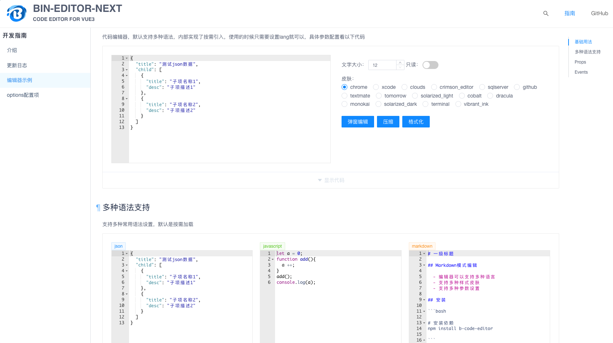
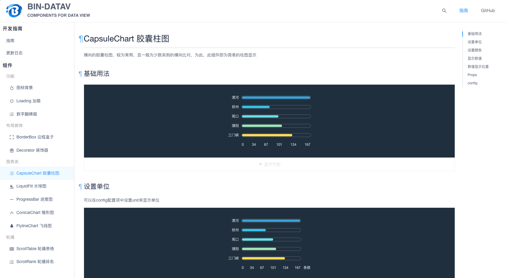
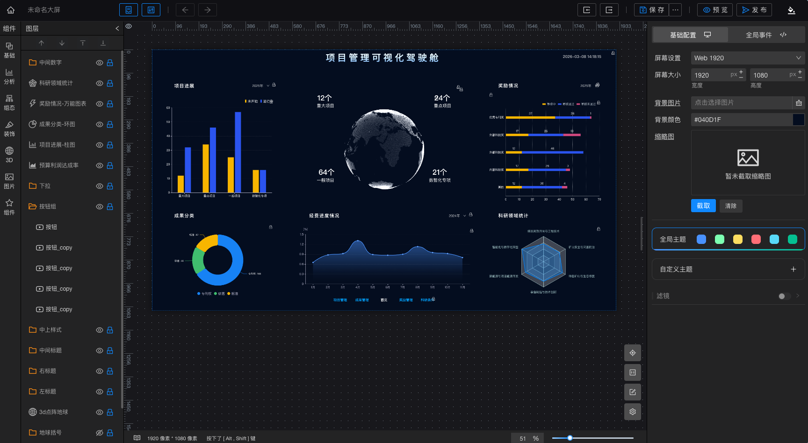
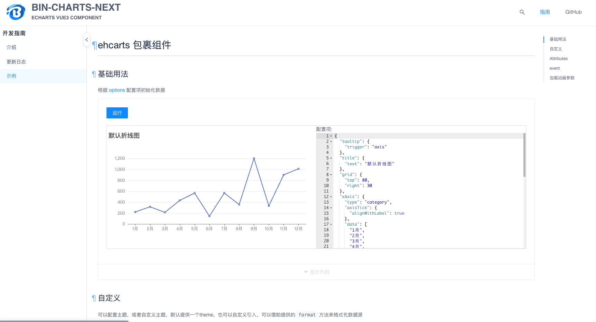
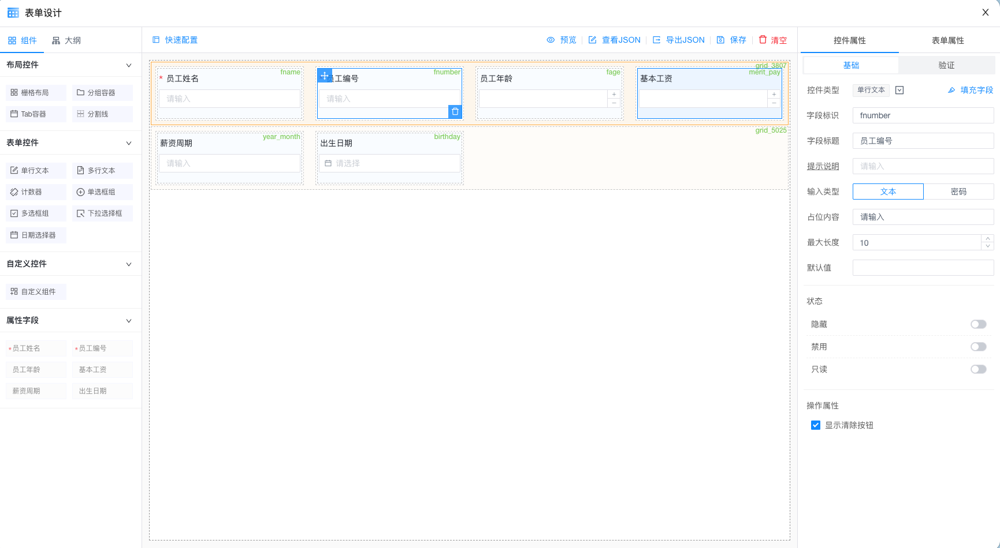
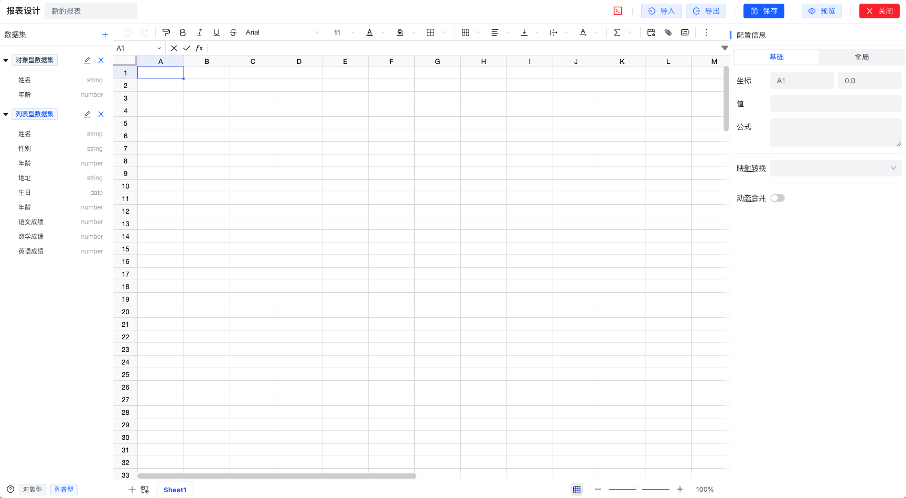
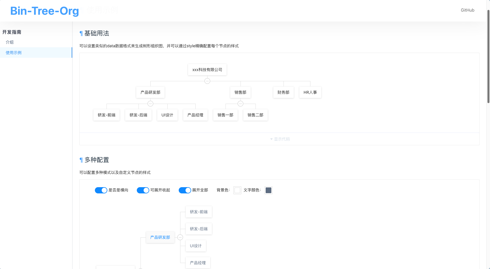
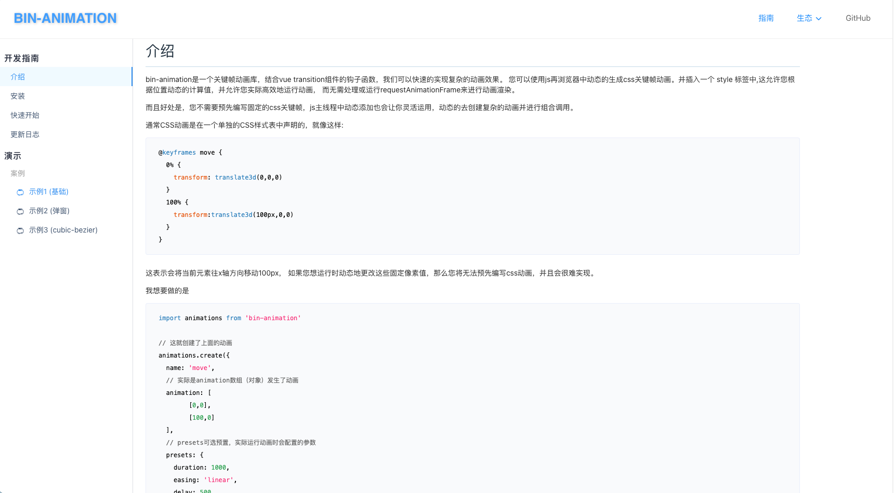

# 开源组件库合集

> 基于 Vue3 生态的数据可视化与组件库解决方案

---

## 📦 组件库列表

### 1. bin-ui-design

一个基于 Vue3 和 TypeScript 的组件库

| 项目 | 链接 |
|------|------|
| 🌐 在线预览 | https://wangbin3162.github.io/bin-ui-design |
| 💻 GitHub | https://github.com/wangbin3162/bin-ui-design |
| 📖 技术栈 | Vue3 + TypeScript |

---

### 2. bin-admin-pro

基于 bin-ui 的后端管理系统

| 项目 | 链接 |
|------|------|
| 🌐 在线预览 | https://wangbin3162.github.io/bin-admin-pro |
| 💻 GitHub | https://github.com/wangbin3162/bin-admin-pro |
| 📖 技术栈 | Vue3 全家桶 |

---

### 3. bin-editor-next

基于 brace 的 Vue3 编辑器组件库

| 项目 | 链接 |
|------|------|
| 🌐 在线预览 | https://wangbin3162.github.io/bin-editor-next |
| 💻 GitHub | https://github.com/wangbin3162/bin-editor-next |
| 📖 技术栈 | Vue3 + brace |

---

### 4. bin-datav

一个基于 Vue3 和 TypeScript 的数据可视化组件库

| 项目 | 链接 |
|------|------|
| 🌐 在线预览 | https://wangbin3162.github.io/bin-datav |
| 💻 GitHub | https://github.com/wangbin3162/bin-datav |
| 📖 技术栈 | Vue3 + TypeScript |

---

### 5. bin-datav-schema

vite + vue3 + bin-ui-design + bin-datav 的数据可视化大屏框架

| 项目 | 链接 |
|------|------|
| 🌐 在线预览 | https://wangbin3162.github.io/bin-datav-schema |
| 💻 GitHub | https://github.com/wangbin3162/bin-datav-schema |
| 📖 技术栈 | Vue3 + TypeScript |

---

### 6. bin-grid-layout

一个基于 Vue3 和 TypeScript 的网格布局组件库

| 项目 | 链接 |
|------|------|
| 🌐 在线预览 | https://wangbin3162.github.io/bin-grid-layout |
| 💻 GitHub | https://github.com/wangbin3162/bin-grid-layout |
| 📖 技术栈 | Vue3 + TypeScript |

---

### 7. bin-charts-next

一个基于 Vue3 和 echarts 的图表组件库

| 项目 | 链接 |
|------|------|
| 🌐 在线预览 | https://wangbin3162.github.io/bin-charts-next |
| 💻 GitHub | https://github.com/wangbin3162/bin-charts-next |
| 📖 技术栈 | Vue3 + ECharts |

---

### 8. bin-form-maker

一个基于 Vue3 和 TypeScript 的表单生成器组件库

| 项目 | 链接 |
|------|------|
| 🌐 在线预览 | https://wangbin3162.github.io/bin-form-maker |
| 💻 GitHub | https://github.com/wangbin3162/bin-form-maker |
| 📖 技术栈 | Vue3 + TypeScript |

---

### 9. bin-excel-pro

一个基于 Vue3 和 univer 的 Excel 表格组件库

| 项目 | 链接 |
|------|------|
| 🌐 在线预览 | https://wangbin3162.github.io/bin-excel-pro |
| 💻 GitHub | https://github.com/wangbin3162/bin-excel-pro |
| 📖 技术栈 | Vue3 + Univer |

---

### 10. bin-tree-org

一个基于 Vue2 的组织树组件

| 项目 | 链接 |
|------|------|
| 🌐 在线预览 | https://wangbin3162.github.io/bin-tree-org |
| 💻 GitHub | https://github.com/wangbin3162/bin-tree-org |
| 📖 技术栈 | Vue2 |

---

### 11. bin-animation

基于 vue，结合 transition 钩子函数配合的 css3 动画库

| 项目 | 链接 |
|------|------|
| 🌐 在线预览 | https://wangbin3162.github.io/bin-animation |
| 💻 GitHub | https://github.com/wangbin3162/bin-animation |
| 📖 技术栈 | Vue |

---

### 12. bin-keyframe-animation

js 关键帧动画库

| 项目 | 链接 |
|------|------|
| 🌐 在线预览 | https://wangbin3162.github.io/bin-keyframe-animation |
| 💻 GitHub | https://github.com/wangbin3162/bin-keyframe-animation |
| 📖 技术栈 | JavaScript |

---

## 🔗 快速链接

| 名称 | 地址 |
|------|------|
| 🏠 主页 | https://wangbin3162.github.io |
| 📚 组件库文档 | https://wangbin3162.github.io/bin-ui-design |

---

## 📄 许可证

[MIT](https://github.com/wangbin3162/bin-ui-design/blob/master/LICENSE)

---

> 💡 **提示**: 点击上方预览图或链接即可访问对应项目的在线演示和源码。
