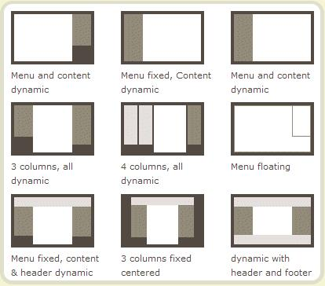
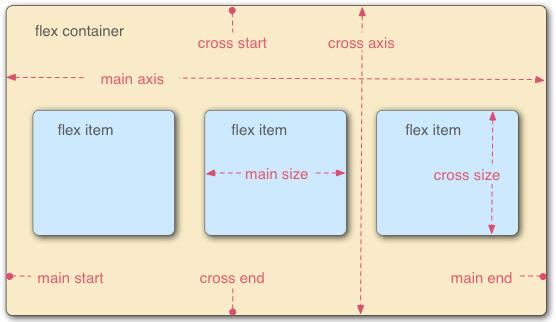

# Flex-Box布局

本文小结借鉴了[阮一峰Flex布局]( http://www.ruanyifeng.com/blog/2015/07/flex-grammar.html?utm_source=tuicool)

深入实践课参阅[阮一峰Flex布局实例篇](http://www.ruanyifeng.com/blog/2015/07/flex-examples.html)



布局的传统解决方案，基于盒状模型，依赖 display 属性 + position属性 + float属性。它对于那些特殊布局非常不方便，比如，垂直居中就不容易实现。

2009年，W3C 提出了一种新的方案----Flex 布局，可以简便、完整、响应式地实现各种页面布局。目前，它已经得到了所有浏览器的支持，这意味着，现在就能很安全地使用这项功能。

## 一、Flex 布局是什么？

Flex 是 Flexible Box 的缩写，意为"弹性布局"，用来为盒状模型提供最大的灵活性。

任何一个容器都可以指定为 Flex 布局。

```css
.box{
    display: flex;
}
```

行内元素也可以使用 Flex 布局。
```css
.box{
    display: inline-flex;
}
```

Webkit 内核的浏览器，必须加上-webkit前缀。
```css
.box{
    display: -webkit-flex; /* Safari */
    display: flex;
}
```
注意，设为 Flex 布局以后，子元素的float、clear和vertical-align属性将失效。

## 二、基本概念

采用 Flex 布局的元素，称为 Flex 容器（flex container），简称"容器"。它的所有子元素自动成为容器成员，称为 Flex 项目（flex item），简称"项目"。



容器默认存在两根轴：水平的主轴（main axis）和垂直的交叉轴（cross axis）。主轴的开始位置（与边框的交叉点）叫做`main start`，结束位置叫做`main end`；
交叉轴的开始位置叫做`cross start`，结束位置叫做`cross end`。

项目默认沿主轴排列。单个项目占据的主轴空间叫做`main size`，占据的交叉轴空间叫做`cross size`。

## 三、容器的属性

以下6个属性设置在容器上。

- flex-direction
- flex-wrap 
- flex-flow 
- justify-content
- align-items
- align-content

### 3.1 flex-direction属性

`flex-direction`属性决定主轴的方向（即项目的排列方向）。
```css
.box {
  flex-direction: row | row-reverse | column | column-reverse;
}
```

- row（默认值）：主轴为水平方向，起点在左端。
- row-reverse：主轴为水平方向，起点在右端。
- column：主轴为垂直方向，起点在上沿。
- column-reverse：主轴为垂直方向，起点在下沿。

### 3.2 flex-wrap属性

默认情况下，项目都排在一条线（又称"轴线"）上。flex-wrap属性定义，如果一条轴线排不下，如何换行。

```css
.box {
   flex-wrap: nowrap | wrap | wrap-reverse;
}
```

- nowrap（默认）：不换行。
- wrap：换行，第一行在上方。
- wrap-reverse：换行，第一行在下方。

### 3.3 flex-flow

flex-flow属性是`flex-direction`属性和`flex-wrap`属性的简写形式，默认值为row nowrap。

```css
.box {
 flex-flow: <flex-direction> || <flex-wrap>;
}
```

### 3.4 justify-content属性

`justify-content`属性定义了项目在主轴上的对齐方式。

```css
.box {
 justify-content: flex-start | flex-end | center | space-between | space-around;
}
```

- flex-start（默认值）：左对齐
- flex-end：右对齐
- center： 居中
- space-between：两端对齐，项目之间的间隔都相等。
- space-around：每个项目两侧的间隔相等。所以，项目之间的间隔比项目与边框的间隔大一倍。

### 3.5 align-items属性

`align-items`属性定义项目在交叉轴上如何对齐。

```css
.box {
    align-items: flex-start | flex-end | center | baseline | stretch;
}
```

- flex-start：交叉轴的起点对齐。
- flex-end：交叉轴的终点对齐。
- center：交叉轴的中点对齐。
- baseline: 项目的第一行文字的基线对齐。
- stretch（默认值）：如果项目未设置高度或设为auto，将占满整个容器的高度。

### 3.6 align-content属性

`align-content`属性定义了多根轴线的对齐方式。如果项目只有一根轴线，该属性不起作用。

```css
.box {
     align-content: flex-start | flex-end | center | space-between | space-around | stretch;
}
```

- flex-start：与交叉轴的起点对齐。
- flex-end：与交叉轴的终点对齐。
- center：与交叉轴的中点对齐。
- space-between：与交叉轴两端对齐，轴线之间的间隔平均分布。
- space-around：每根轴线两侧的间隔都相等。所以，轴线之间的间隔比轴线与边框的间隔大一倍。
- stretch（默认值）：轴线占满整个交叉轴。

## 四、项目的属性

以下6个属性设置在项目上。

- order
- flex-grow
- flex-shrink
- flex-basis
- flex
- align-self

### 4.1 order属性

`order`属性定义项目的排列顺序。数值越小，排列越靠前，默认为0。

```css
.item {
  order: <integer>;
}
```

### 4.2 flex-grow属性

`flex-grow`属性定义项目的放大比例，默认为0，即如果存在剩余空间，也不放大。

```css
.item {
 flex-grow: <number>; /* default 0 */
}
```

如果所有项目的flex-grow属性都为1，则它们将等分剩余空间（如果有的话）。如果一个项目的flex-grow属性为2，其他项目都为1，则前者占据的剩余空间将比其他项多一倍。

### 4.3 flex-shrink属性

`flex-shrink`属性定义了项目的缩小比例，默认为1，即如果空间不足，该项目将缩小。

```css
.item {
  flex-shrink: <number>; /* default 1 */
}
```

如果所有项目的flex-shrink属性都为1，当空间不足时，都将等比例缩小。如果一个项目的flex-shrink属性为0，其他项目都为1，则空间不足时，前者不缩小。

负值对该属性无效。

### 4.4 flex-basis属性

`flex-basis`属性定义了在分配多余空间之前，项目占据的主轴空间（main size）。浏览器根据这个属性，计算主轴是否有多余空间。它的默认值为auto，即项目的本来大小。

```css
.item {
  flex-basis: <length> | auto; /* default auto */
}
```

它可以设为跟`width`或`height`属性一样的值（比如350px），则项目将占据固定空间。

### 4.5 flex属性

`flex`属性是`flex-grow`, `flex-shrink` 和 `flex-basis`的简写，默认值为`0 1 auto`。后两个属性可选。

```css
.item {
   flex: none | [ <'flex-grow'> <'flex-shrink'>? || <'flex-basis'> ]
}
```

该属性有两个快捷值：`auto` `(1 1 auto)` 和 `none` `(0 0 auto)`。

建议优先使用这个属性，而不是单独写三个分离的属性，因为浏览器会推算相关值。


### 4.6 align-self属性

align-self属性允许单个项目有与其他项目不一样的对齐方式，可覆盖align-items属性。默认值为auto，
表示继承父元素的align-items属性，如果没有父元素，则等同于stretch。

```css
.item {
   align-self: auto | flex-start | flex-end | center | baseline | stretch;
}
```

该属性可能取6个值，除了auto，其他都与align-items属性完全一致。

## 五、flex-auto-prefixer

由于浏览器存在兼容问题，故编写了一套flex-auto-prefixer.css 用于适应浏览器兼容

### 代码
```css
.flex {
	display: -webkit-box; /* OLD - iOS 6-, Safari 3.1-6 */
	display: -moz-box; /* OLD - Firefox 19- (buggy but mostly works) */
	display: -ms-flexbox; /* TWEENER - IE 10 */
	display: -webkit-flex; /* NEW - Chrome */
	display: flex; /* NEW, Spec - Opera 12.1, Firefox 20+ */
}

/* 父元素-横向换行 */
.flex-wrap {
	-webkit-flex-wrap: wrap;
	-moz-flex-wrap: wrap;
	-ms-flex-wrap: wrap;
	-o-flex-wrap: wrap;
	flex-wrap: wrap;
}

/*伸缩流方向*/
.flex-direction_column {
	-webkit-box-orient: vertical;
	-ms-flex-direction: column;
	-webkit-flex-direction: column;
	flex-direction: column;
}

/*主轴对齐*/
.justify-content_flex-center {
	-webkit-box-pack: center;
	-ms-flex-pack: center;
	-webkit-justify-content: center;
	justify-content: center;
}

.justify-content_flex-end {
	-webkit-box-pack: end;
	-ms-flex-pack: end;
	-webkit-justify-content: flex-end;
	justify-content: flex-end;
}

.justify-content_space-around {
	-webkit-justify-content: space-around;
	justify-content: space-around;
}

.justify-content_space-between {
	-webkit-box-pack: justify;
	-ms-flex-pack: justify;
	-webkit-justify-content: space-between;
	justify-content: space-between;
}

/*侧轴对齐*/
.align-items_flex-start {
	-webkit-box-align: start;
	-ms-flex-align: start;
	-webkit-align-items: flex-start;
	align-items: flex-start;
}

.align-items_flex-end {
	-webkit-box-align: end;
	-ms-flex-align: end;
	-webkit-align-items: flex-end;
	align-items: flex-end;
}

.align-items_center {
	-webkit-box-align: center;
	-ms-flex-align: center;
	-webkit-align-items: center;
	align-items: center;
}

.align-items_baseline {
	-webkit-box-align: baseline;
	-ms-flex-align: baseline;
	-webkit-align-items: baseline;
	align-items: baseline;
}

/*伸缩性*/
.flex_auto {
	-webkit-box-flex: 1;
	-ms-flex: auto;
	-webkit-flex: auto;
	flex: auto;
}

.flex_1 {
	-webkit-box-flex: 1;
	-ms-flex: 1;
	-webkit-flex: 1;
	flex: 1;
}
```

### 使用
```html
<!--直接往class上追加即可实现大部分常用布局-->
<div class="flex justify-content_space-around">
    <div class="flex_1"></div>
</div>
```