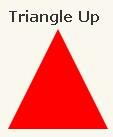
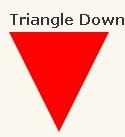
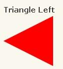
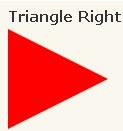
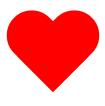

# html-css相关

## Sticky footer布局

> 如果页面内容不够长的时候，页脚块粘贴在视窗底部；如果内容足够长时，页脚块会被内容向下推送

```html
<div class="main-wrapper">
    <div class="auto-wrapper"></div>
</div>
<div class="footer"></div>
```

```css
.main-wrapper {
    width: 100%;
    min-height: 100%;
}
.auto-wrapper {
    padding-bottom: 64px;
}
.footer {
    position: relative;
    margin: -64px auto 0;
}
```

## 纯CSS绘制三角形

CSS 三角形绘制方法


```css
#triangle-up {
    width: 0;
    height: 0;
    border-left: 50px solid transparent;
    border-right: 50px solid transparent;
    border-bottom: 100px solid red;
}
```


```css
#triangle-down {
    width: 0;
    height: 0;
    border-left: 50px solid transparent;
    border-right: 50px solid transparent;
    border-top: 100px solid red;
}
```


```css
#triangle-left {
    width: 0;
    height: 0;
    border-top: 50px solid transparent;
    border-right: 100px solid red;
    border-bottom: 50px solid transparent;
}
```


```css
#triangle-right {
    width: 0;
    height: 0;
    border-top: 50px solid transparent;
    border-left: 100px solid red;
    border-bottom: 50px solid transparent;
}
```

## CSS绘制爱心



```css
#heart { 
    position: relative; 
    width: 100px; 
    height: 90px; 
} 
#heart:before, #heart:after { 
    position: absolute; 
    content: ""; 
    left: 50px; 
    top: 0; 
    width: 50px; 
    height: 80px; 
    background: red; 
    -moz-border-radius: 50px 50px 0 0; 
    border-radius: 50px 50px 0 0; 
    -webkit-transform: rotate(-45deg); 
    -moz-transform: rotate(-45deg); 
    -ms-transform: rotate(-45deg); 
    -o-transform: rotate(-45deg); 
    transform: rotate(-45deg); 
    -webkit-transform-origin: 0 100%; 
    -moz-transform-origin: 0 100%; 
    -ms-transform-origin: 0 100%; 
    -o-transform-origin: 0 100%; 
    transform-origin: 0 100%; 
} 
#heart:after { 
    left: 0; 
    -webkit-transform: rotate(45deg); 
    -moz-transform: rotate(45deg); 
    -ms-transform: rotate(45deg); 
    -o-transform: rotate(45deg); 
    transform: rotate(45deg); 
    -webkit-transform-origin: 100% 100%; 
    -moz-transform-origin: 100% 100%; 
    -ms-transform-origin: 100% 100%; 
    -o-transform-origin: 100% 100%; 
    transform-origin :100% 100%; 
} 
```

## dom选择器优先级是什么，以及权重值计算（一道老问题了）

    1.行内样式 1000
    2.id 0100
    3.类选择器、伪类选择器、属性选择器[type="text"] 0010
    4.标签选择器、伪元素选择器(::first-line) 0001
    5.通配符*、子选择器、相邻选择器 0000

## CSS3新特性

- 1、颜色：新增RGBA、HSLA模式
- 2、文字阴影(text-shadow)
- 3、边框：圆角（border-radius）边框阴影：box-shadow
- 4、盒子模型：box-sizing
- 5、背景：background-size设置背景图片的尺寸，background-origin设置背景图片的原点，background-clip设置背景图片的裁剪区域，以“，”分隔可以设置多背景，用于自适应布局
- 6、渐变：linear-gradient、radial-gradient
- 7、过渡：transition可实现动画
- 8、自定义动画
- 9、在CSS3中唯一引入的伪元素是::selection
- 10、多媒体查询、多栏布局
- 11、border-image
- 12、2D转换：transform:translate(x,y)rotate(x,y)skew(x,y)scale(x,y)
- 13、3D转换

## 四种定位的区别

    `static` 是默认值
    `relative` 相对定位 相对于自身原有位置进行偏移，仍处于标准文档流中
    `absolute` 绝对定位 相对于最近的已定位的祖先元素, 有已定位(指`position`不是`static`的元素)祖先元素, 以最近的祖先元素为参考标准。如果无已定位祖先元素, 以`body`元素为偏移参照基准, 完全脱离了标准文档流。
    `fixed` 固定定位的元素会相对于视窗来定位,这意味着即便页面滚动，它还是会停留在相同的位置。一个固定定位元素不会保留它原本在页面应有的空隙。

## 重排和重绘

部分渲染树（或者整个渲染树）需要重新分析并且节点尺寸需要重新计算。这被称为重排。注意这里至少会有一次重排-初始化页面布局。
由于节点的几何属性发生改变或者由于样式发生改变，例如改变元素背景色时，屏幕上的部分内容需要更新。这样的更新被称为重绘。

## 什么情况会触发重排和重绘

添加、删除、更新 DOM 节点
通过 display: none 隐藏一个 DOM 节点-触发重排和重绘
通过 visibility: hidden 隐藏一个 DOM 节点-只触发重绘，因为没有几何变化
移动或者给页面中的 DOM 节点添加动画
添加一个样式表，调整样式属性
用户行为，例如调整窗口大小，改变字号，或者滚动。
